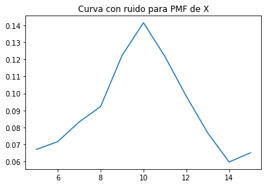
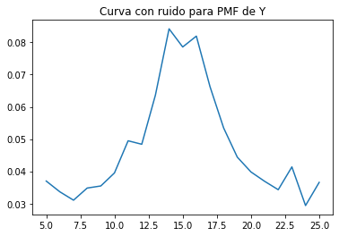

# ** Variables Aleatorias Multiples **
Universidad de Costa Rica

Modelos Probabilisticos de señales y sistemas

Kevin Picado Soto A94779

###  TAREA 3
1. (25 %) A partir de los datos, encontrar la mejor curva de ajuste (modelo probabilístico) para las funciones de densidad marginales de X y Y.
2. (25 %) Asumir independencia de X y Y. Analíticamente, ¿cuál es entonces la expresión de la función de densidad conjunta que modela los datos?
3. (25 %) Hallar los valores de correlación, covarianza y coeficiente de correlación (Pearson) para los datos y explicar su significado.
4. (25 %) Graficar las funciones de densidad marginales (2D), la función de densidad conjunta (3D).

### Solución

### PUNTO 1
Para el primer enunciado  se procede a buscar las funciones marginales de X y Y , para esto se inicia importando las librerias necesarias como pandas para leer los archivos .csv , numpy para las opreciones matematicas y matplotlib para graficar.
Este primer inciso al realizar la sumatoria de los datos  por filas y columnas se obtienen los vectores necesarios para graficar las funciones marginales de X y Y por medio del siguiente codigo.
```python
######paquetes utlizados 
import pandas as pd 
import numpy as np 
import matplotlib.pyplot as plt 
from scipy.optimize import curve_fit 
from matplotlib.pyplot import * 
from pylab import * 
from mpl_toolkits.mplot3d.axes3d import Axes3D 
###### #se llama el archivo tipo csv y se nombran las columnas 
datosxy = pd.read_csv('xy.csv',skiprows=0,names=['5','6','7','8','9','10','11','12','13','14','15','16','17','18','19','20','21','22','23','24','25'],header=0) \
###### #se establecen la sumatoria de todas las columnas y filas 
###### #para encontra la PMF en X y Y 
Fy=np.sum(datosxy,axis=0)#PMF Y 
Fx=np.sum(datosxy,axis=1)#PMF X 
###### #se establecen los vectores de Xs y Ys
Xs=np.linspace(5,15,11)#se hace un vector con el tamano para todas las X 
Ys=np.linspace(5,25,21)#se hace un vector con el tamano para todas las Y 
print('Los datos dela PMF de X:') 
print(Fx) 
print()
print('Los datos dela PMF de Y:') 
print(Fy) 
###### #Se grafico para ver el comportamiento original de las funciones maginales X y Y 
plt.plot(Ys, Fy) 
plt.title("Curva con ruido para PMF de Y") 
plt.show() 
plt.plot(Xs, Fx) 
plt.title("Curva con ruido para PMF de X") 
plt.show() 
```
 \
Con esto se puede ver que el comportamiento de ambas funciones marginales es gaussiana pero con ruido, por lo que define una la funcion gaussina y por medio de un modelo se buscan sus parametros de ajuste para encontrar las curvas ajustadas sin el ruido que con el codigo. 
```python
###### de ajjuste mu y sigma 
def gaus(x,mu,sigma):
    return 1/(np.sqrt(2*np.pi*sigma**2))*np.exp(-(x-mu)**2/(2*sigma**2))
###### #se hallan los parametros de las curvas de ajuste para Fx y Fy conel modelo
parax,_=curve_fit(gaus,Xs,Fx)
paray,_=curve_fit(gaus,Ys,Fy)

###### # se nombran adecuadamente los parametros obtenidos 
mux=parax[0] 
sigx=parax[1] 
muy=paray[0] 
sigy=paray[1] 

print('Parametros para Funcion marginal de X ')
print('mu=',mux,'    sigma=',sigx)
print()
print('Parametros para Funcion marginal de Y ')
print('mu=',muy,'    sigma=',sigy)
print()

```
aqui obtenemos los resultados de nuestros parametros para ajustar las curvas mas adelante \
Parametros para Funcion marginal de X \
mu= 9.904843809352778     sigma= 3.2994428756632264

Parametros para Funcion marginal de Y \
mu= 15.079460902953686     sigma= 6.026937751566297
   
### PUNTO 2

En este punto se busca la funcion de desidad conjunta la cual al asumir independicia entre X y Y Y considerandos nuestros datos discretos tenemos que\

